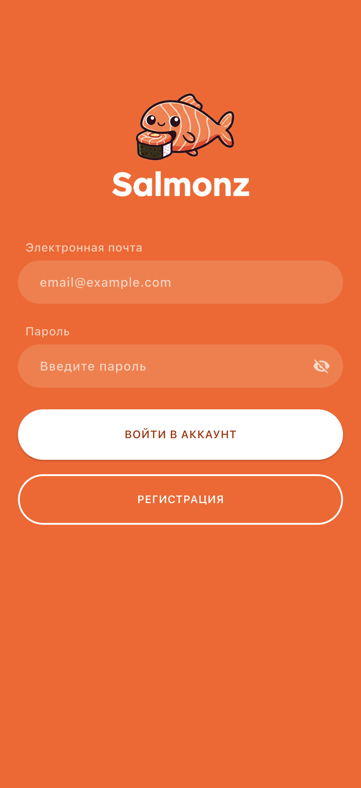
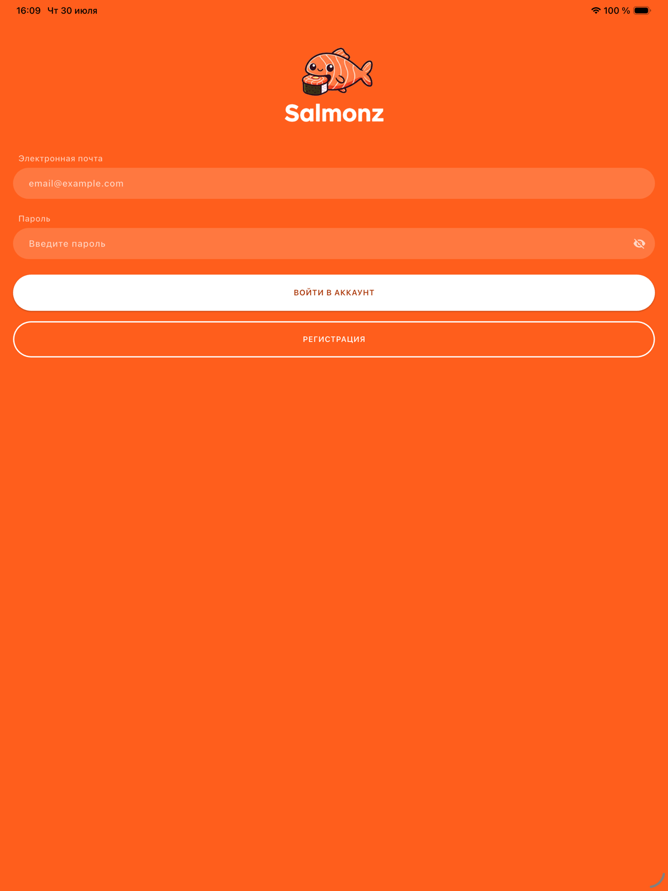
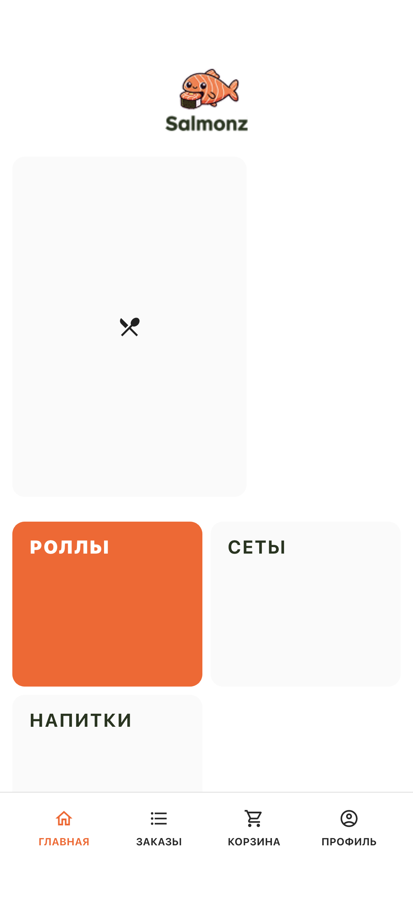
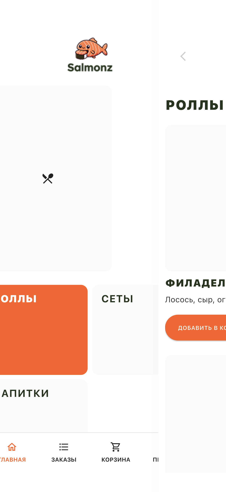
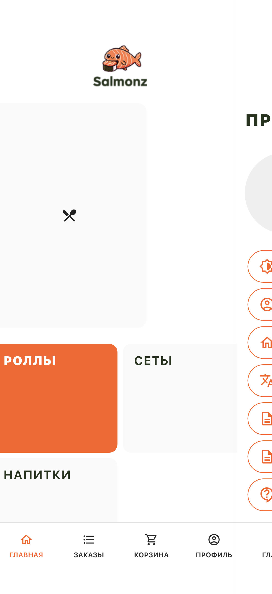
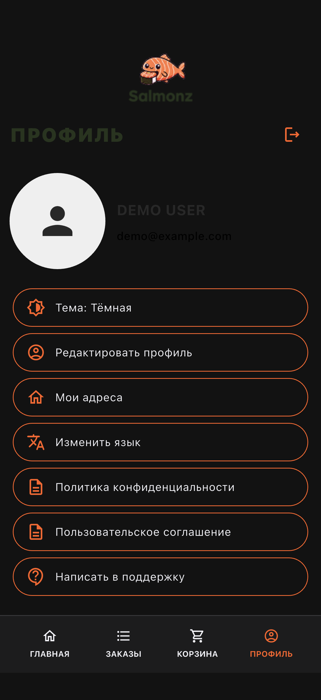

# SALMONZ — магазин доставки суши

<p align="center">
  
  
  
  
  <a href="https://github.com/gadzhilaev/salmonz/actions/workflows/flutter.yml"></a>
  <a href="https://github.com/gadzhilaev/salmonz/actions/workflows/backend.yml"></a>
</p>

<p align="center">
  <b>Портфолио / demo: Flutter-клиент + NestJS REST API</b>
</p>

---

## О проекте

**Salmonz** — кроссплатформенное приложение службы доставки японской кухни. Стек: **Flutter + NestJS + Prisma + PostgreSQL** (JWT auth, каталог, заказы с server-side quote, админ-панель, загрузка медиа).

> Это **портфолио / demo**, а не production-ready продукт. Нет платежей, push, полноценного мониторинга и жёстких SLA. Не используйте как есть в коммерческой эксплуатации без доработки.

Документация: [LOCAL_DEVELOPMENT](docs/LOCAL_DEVELOPMENT.md) · [ARCHITECTURE](docs/ARCHITECTURE.md) · [API](docs/API.md) · [BACKEND](docs/BACKEND.md) · [TESTING](docs/TESTING.md) · [SECURITY](docs/SECURITY.md) · [CONTRIBUTING](CONTRIBUTING.md)

---

## Скриншоты

| Login (iPhone) | Login (iPad) | Home |
|---|---|---|
|  |  |  |

| Category | Profile (light) | Profile (dark) |
|---|---|---|
|  |  |  |

Снято на iOS Simulator (iPhone 17 Pro / iPad Pro) против локального API.

---

## Функциональность

### Пользователь

| Функция | Описание |
|---------|----------|
| Аутентификация | Email/пароль, JWT access + refresh, secure storage |
| Каталог | Категории и товары |
| Корзина | Локально (SharedPreferences) |
| Заказ | Адрес, телефон, комментарий; цены считает сервер (`/orders/quote`) |
| Idempotency | Повторный submit с тем же ключом не создаёт дубликат |
| История заказов | Список и детали |
| Профиль / адреса / support | CRUD адреса, аватар, обращения |
| Тема | System / light / dark |

### Администратор

| Функция | Описание |
|---------|----------|
| Админ-панель | Роль `ADMIN` |
| Каталог | CRUD категорий, продуктов, акций + upload изображений |
| Заказы | Список и смена статуса |
| Пользователи / support | Просмотр и обработка |

---

## Архитектура

```
Flutter (Dio + flutter_secure_storage)
        │  REST  /api/v1
        ▼
NestJS modular monolith  ·  Swagger /docs
        │
   ┌────┴────┐
PostgreSQL   Storage: local FS  или  S3/MinIO
(Prisma 7)
```

Подробнее: [docs/ARCHITECTURE.md](docs/ARCHITECTURE.md).

---

## Быстрый старт

### Требования

- Flutter SDK 3.9+, Node.js 20+, Docker (рекомендуется)
- **Git LFS** (`git lfs install && git lfs pull`) — PNG-ассеты хранятся в LFS

### Backend (Docker Compose)

```bash
cp docker-compose.example.env .env   # задайте JWT_* (длинные случайные строки)
docker compose up --build
```

Сервисы: `postgres`, `minio`, `minio-init`, `backend` (migrate + seed при старте).

- API: `http://localhost:3000/api/v1`
- Swagger: `http://localhost:3000/docs`
- MinIO console: `http://localhost:9001`

Альтернатива без Docker backend: Postgres в Compose + `STORAGE_DRIVER=local`, см. [docs/LOCAL_DEVELOPMENT.md](docs/LOCAL_DEVELOPMENT.md).

### Flutter

```bash
cp config/local.example.json config/local.json
# iOS Simulator / desktop: http://127.0.0.1:3000
# Android emulator:        http://10.0.2.2:3000

flutter pub get
flutter run --dart-define-from-file=config/local.json
```

Demo-учётки после seed (только локально, **смените** перед любым shared env):

| Role | Email | Password |
|------|-------|----------|
| USER | `demo@example.com` | `ChangeMeDemo123!` |
| ADMIN | `admin@example.com` | `ChangeMeAdmin123!` |

Секреты не коммитятся: `.env`, `backend/.env`, `config/local.json` в `.gitignore`.

---

## Тесты

```bash
# Backend
cd backend && npm ci && npm run prisma:generate
npm test && npm run lint && npm run build
RUN_E2E=1 npm run test:e2e   # нужен живой API + seed

# Flutter
flutter analyze && flutter test
flutter test integration_test -d <device> --dart-define-from-file=config/local.json
```

CI: `.github/workflows/backend.yml`, `.github/workflows/flutter.yml` (analyze/unit/build; e2e с БД — локально).

---

## Storage

| `STORAGE_DRIVER` | Поведение |
|------------------|-----------|
| `local` (host-run default) | Файлы в `backend/uploads`, URL `/media/...` |
| `s3` (Compose default) | MinIO/S3-compatible bucket |

---

## Ограничения demo

- Нет эквайринга / push / email
- Seed-пароли только для локальной разработки
- Ранняя Git history может содержать старый Supabase anon JWT — в текущем HEAD его нет; владелец должен отключить/ротировать старый Supabase-проект
- npm audit может показывать transitive high (например через swagger) без безопасного fix без major downgrade

---

## Лицензия

MIT — [LICENSE](LICENSE).
